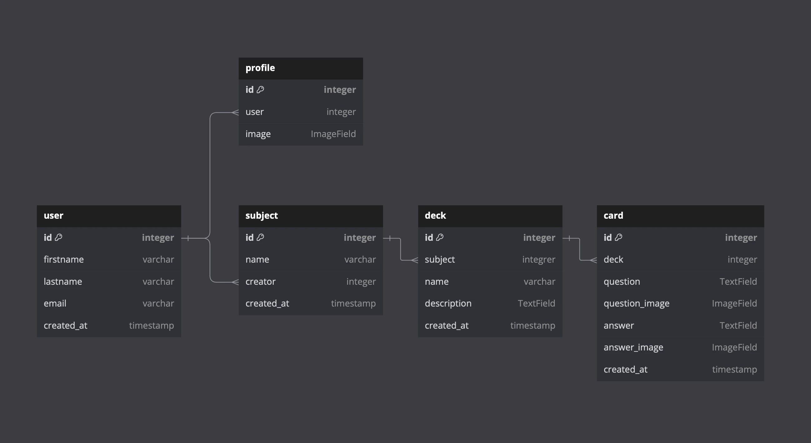
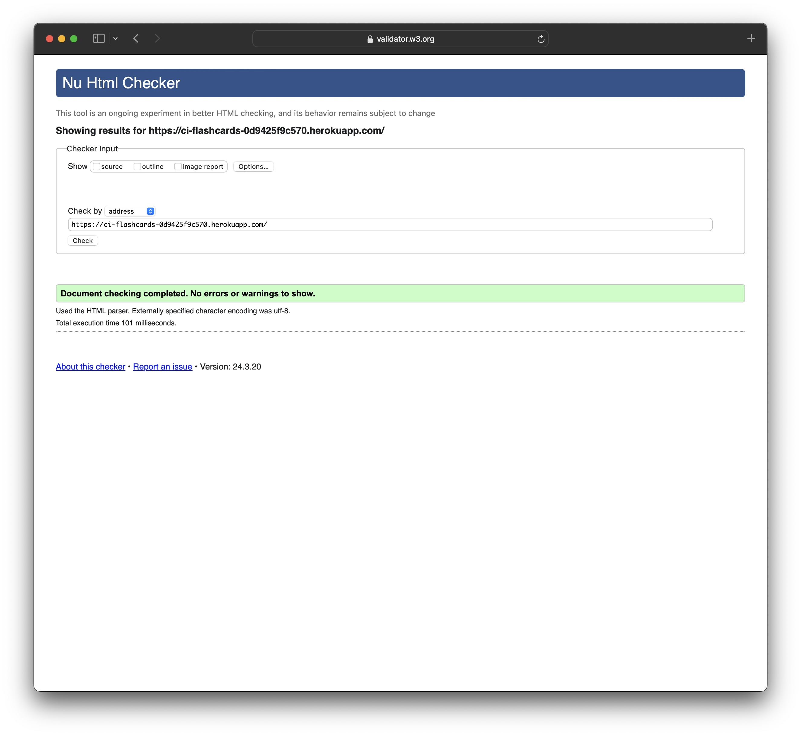
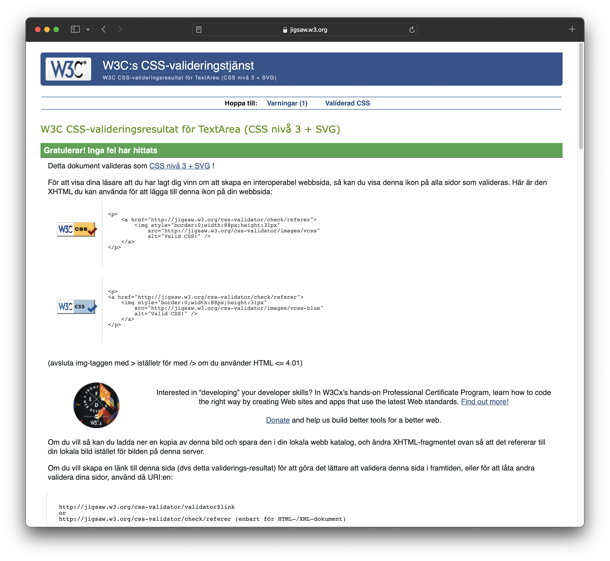
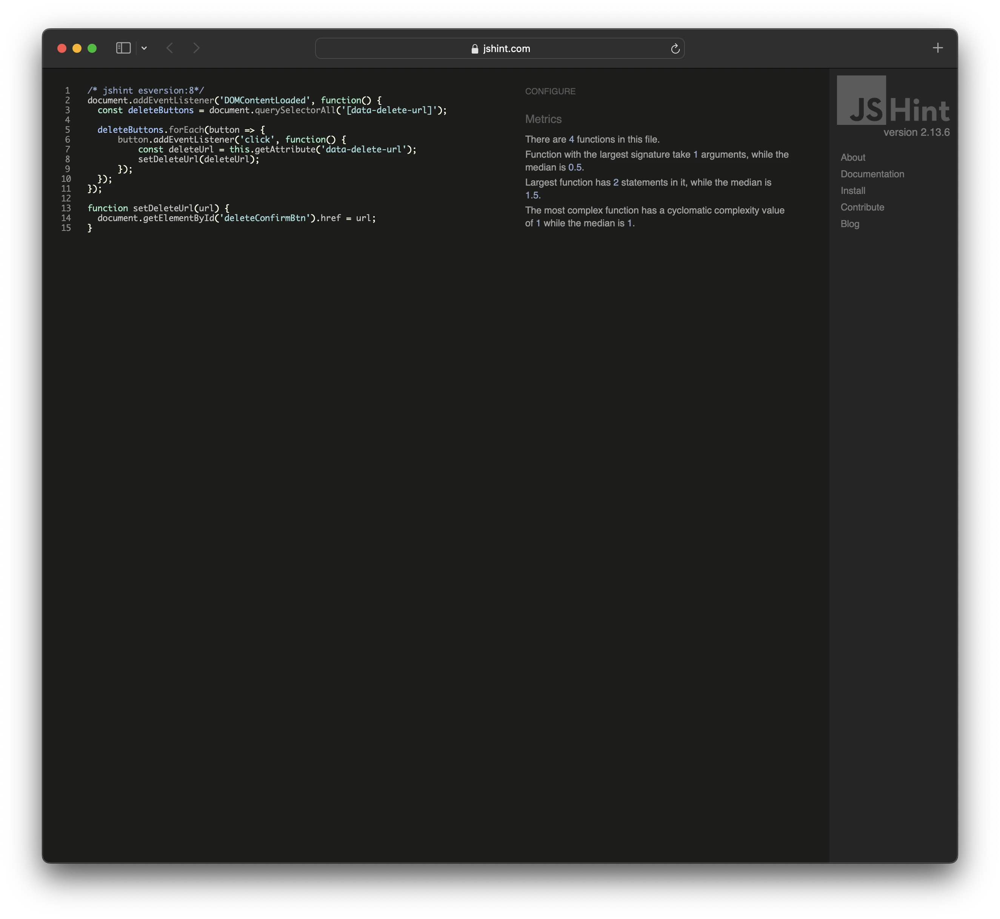
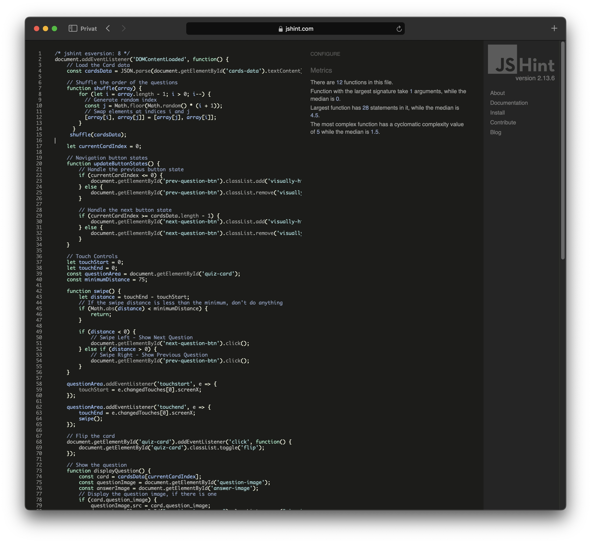
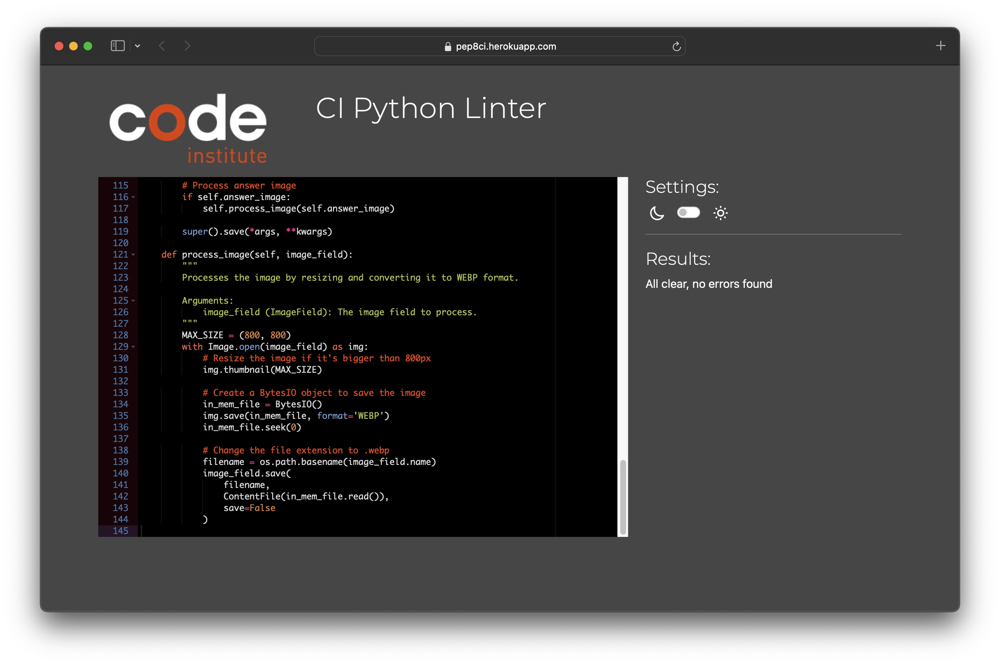

# FlashCards
[FlashCards](https://ci-flashcards-0d9425f9c570.herokuapp.com) is meant to help students learn using the proven method of using flash cards.

## User Stories

## Features

## Future Features

## Development
### Project Inception
The main goal of the project was to create a easy to use and non-distracting app for students. 
### Database ERD

The database was planned out using [dbdiagram.io](https://dbdiagram.io), this was a huge help when creating the models.
### Look and feel
To get a basic layout on how the website should look I used Balsamiq Wireframes. The main goal was to create an minimal clutter-free look that doesn't distract the users from using the flash cards. To give the quiz a more appealing and "fluid" look I looked back on the JavaScript from my previous project [Dungeons and Dices](https://github.com/dvudd/CI_PP2).

### Not sure what to name this section
In order to save space on the hosting site, I have implemented a method to automatically resize user uploaded images and converting them to .webp format.

## Testing
### Validator Testing
#### HTML
No errors were returned when passing through the [W3C Markup validator](https://validator.w3.org/).
<details><summary>Results</summary>



</details>

#### CSS
No errors were found when passing through the [W3C CSS Validator](https://jigsaw.w3.org/css-validator/).
<details><summary>Results</summary>



</details>

#### JavaScript
No errors were found when passing through the [JShint](https://jshint.com) analysis tool using `esversion: 8`.
<details><summary>Results</summary>

script.js


quiz.js


</details>

#### Python
No errors were found then passing through the [CI Python Linter](https://pep8ci.herokuapp.com/#).
<details><summary>Results</summary>



</details>

#### Google Chrome Lighthouse Reports
##### Desktop
##### Mobile
### Manual Testing

### Automatic Testing
Automatic testing is done with django's built-in test module.
There are 37 tests made.
Users:
- Models:
    - Profile creation
    - User Registration
    - User Login
    - Profile updating
    - Subject Creation
    - Deck Creation
    - Card Creation with text question/answer
    - Card Creation with image question/answer
- Forms:
    - User Registration with valid data
    - User Registration with invalid data
    - User Registration with an existing email
    - User Updating
    - Profile Updating
    - Subject Creation
    - Deck Creation
    - Card Creation
- Authentication:
    - User Login with valid credentials
    - User Login with invalid credentials
    - User Logout  
- Views:
    - Home view for authenticated users
    - Home view for non-authenticated users
    - Subject Creation
    - Subject Details
    - Subject Editing
    - Subject Deletion
    - Deck Creation
    - Deck Details
    - Deck Editing
    - Deck Deletion
    - Card Creation
    - Card Details
    - Card Editing
    - Card Deletion
    - Quiz access
    - Quiz context
To run the tests, run the following command:
```sh

python manage.py test

```
## Bugs

### Known Bugs

## Technologies Used
- IDE: Gitpod
- Repository: GitHub
- Deployment: Heroku
- Database hosting: ElephantSQL
- Image hosting: Cloudinary
- Favicon generator: [favicon.io](https://favicon.io/favicon-converter/)

### Languages
- HTML5
- CSS
- JavaScript
- Python
### Libraries
- Django
- Bootstrap
## Deployment
### Heroku
!note: add steps to implement cloudinary and elephantSQL.
[Click here to go to the deployed site](https://ci-flashcards-0d9425f9c570.herokuapp.com)\
The site was deployed to Heroku pages. The steps to deploy a site are as follows:
1. Navigate to [Heroku](https://dashboard.heroku.com/apps)
2. Click on "New", then "Create new app"
3. Enter the app name, select your region, and click on "Create app"
4. Navigate to the "Settings" tab
5. Click on "Add buildpack", select "Python", and click on "Add Buildpack"
6. Click on "Add buildpack" again, this time select "nodejs", and click on "Add Buildpack"
7. Navigate to the "Deploy" tab
8. In the "Deployment method" section, select "GitHub"
9. In the "Connect to GitHub" section, select "Search"
10. Find the desired repository, for this project I used "CI_PP4", and click "Connect"
11. Click on either "Enable Automatic Deploys" or "Deploy Branch"
12. Once the project has been deployed, scroll up and click on "Open app"

### Forking the GitHub Repository
By forking the GitHub Repository, we make a copy of the original repository on our GitHub account to view and/or make changes without affecting the original repository by using the following steps:
1. Log in to GitHub and locate the [GitHub Repository](https://github.com/dvudd/CI_PP4)
2. At the top of the Repository (not top of the page) just above the "Settings" Button on the menu, locate the "Fork" Button.
3. You should now have a copy of the original repository in your GitHub account.
### Making a Local Clone
1. Log in to GitHub and locate the [GitHub Repository](https://github.com/dvudd/CI_PP4)
2. Under the repository name, click "Clone or download".
3. To clone the repository using HTTPS, under "Clone with HTTPS", copy the link.
4. Open Git Bash
5. Change the current working directory to the location where you want the cloned directory to be made.
6. Type `git clone`, and then paste the URL you copied in Step 3.
```sh

$ git clone https://github.com/dvudd/CI_PP4

```
7. Press Enter. Your local clone will be created.
8. Use pip to install the requirements:
```sh

$ pip install requirements.txt

```
9. Run the server:
```sh

$ python manage.py runserver

```
## Credits
- Default profile picture created by juicy_fish on [Freepik](https://www.freepik.com/free-vector/blank-user-circles_134996379.htm#query=default%20user&position=1&from_view=search&track=ais&uuid=a63734c5-5b35-43b9-bbc2-a2bcc1782677#position=1&query=default%20user)
- Pass django variable to JS [Django Docs](https://docs.djangoproject.com/en/5.0/ref/templates/builtins/#json-script))
- Get full path [Django Docs](https://docs.djangoproject.com/en/5.0/ref/request-response/#django.http.HttpRequest.get_full_path)
- Require either an image or an text for question/answer [Stack Overflow](https://stackoverflow.com/questions/46286089/specific-way-of-requiring-one-of-two-fields-in-django-model-definition)
- Javascript Touch events: [MDN](https://developer.mozilla.org/en-US/docs/Web/API/Touch_events/Using_Touch_Events)

### Acknowledgements
- Thank you to my mentor Jack Wachira.\
\
This is my Portfolio Project 4 as part of the Full Stack Software Developer program at [Code Institute](https://codeinstitute.net/).\
David Eriksson 2024