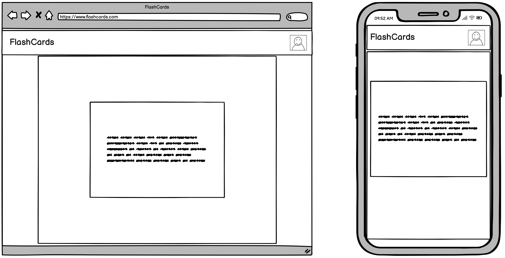
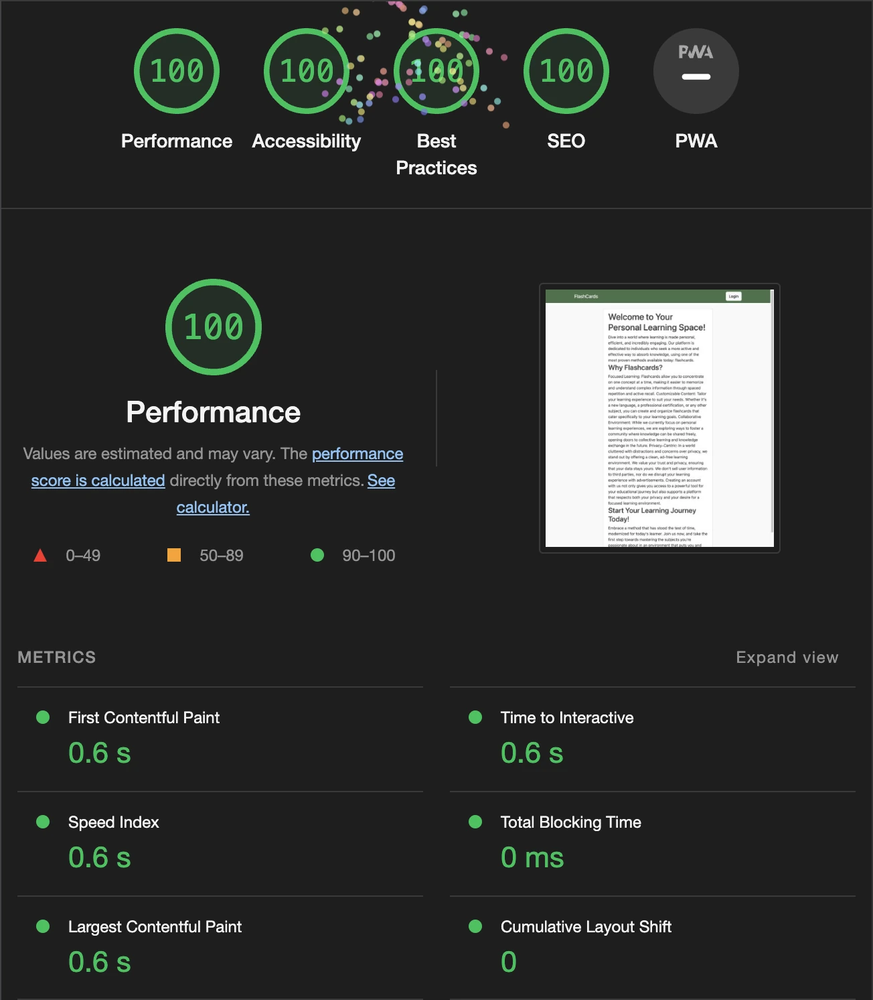
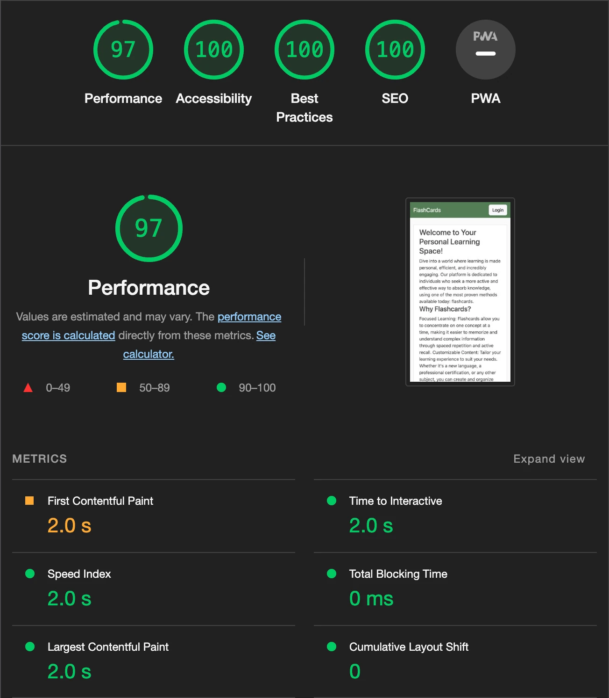

# FlashCards
[FlashCards](https://ci-flashcards-0d9425f9c570.herokuapp.com) is meant to help students learn using the proven method of using flash cards.

## User Stories

## Features

## Future Features

## Development
### Project Inception
The main goal of the project was to create a easy to use and non-distracting app for students. 
### Database ERD

The database was planned out using [dbdiagram.io](https://dbdiagram.io).
### Look and feel
To get a basic layout on how the website should look I used Balsamiq Wireframes. The main goal was to create an minimal clutter-free look that doesn't distract the users from the site's main goal, to learn. To give the quiz a more appealing and "fluid" look I looked back on the JavaScript from my previous project [Dungeons and Dices](https://github.com/dvudd/CI_PP2).
### Wireframes

## Optimization
To ensure a fast and responsive user experience, a method for handling user-uploaded images was implemented to automatically resize (800x800px for card images, 300x300 for profile pictures) and convert to the .webp format. 
By doing this, a significant step to reduce storage space and to improve load times are taken.
## Testing
### Validator Testing
#### HTML
No errors were returned when passing through the [W3C Markup validator](https://validator.w3.org/).
<details><summary>Results</summary>


</details>

#### CSS
No errors were found when passing through the [W3C CSS Validator](https://jigsaw.w3.org/css-validator/).
<details><summary>Results</summary>


</details>

#### JavaScript
No errors were found when passing through the [JShint](https://jshint.com) analysis tool using `esversion: 8`.
<details><summary>Results</summary>

script.js


quiz.js


</details>

#### Python
No errors were found then passing through the [CI Python Linter](https://pep8ci.herokuapp.com/#).
<details><summary>Results</summary>


</details>

#### Google Chrome Lighthouse Reports
##### Desktop
<details><summary>Results</summary>



</details>

##### Mobile
<details><summary>Results</summary>



</details>

### Manual Testing
Since most of the testing is done using automatic tests, the manual tests leaned more on user experience.
| Test Cae | Description | Outcome |
| --------- | ----------- | ------ |
| UX | Site is fully responsive | PASS |
| UX | The correct default profile image is presented | PASS |
| UX | The correct custom profile image is presented | PASS |
| UX | The correct card images is presented | PASS |

### Automatic Testing
Automatic testing is done using Django's built-in test module.
There are 45 tests made and I used [coverage.py](https://coverage.readthedocs.io/en/latest/) to get a grasp on the width of the tests.
The tests covers 98% of the projects code.
| Name | Stmts | Miss| Cover | Missing |
| ---- | ----- | --- | ----- | ------- |
| cards/__init__.py | 0 | 0 | 100% |
| cards/admin.py | 21 | 0 | 100% |
| cards/apps.py | 4 | 0 | 100% |
| cards/forms.py | 14 | 0 | 100% |
| cards/migrations/0001_initial.py | 8 | 0 | 100% |
| cards/migrations/0002_deck.py | 6 | 0 | 100% |
| cards/migrations/0003_card.py | 6 | 0 | 100% |
| cards/migrations/0004_auto_20240216_1844.py | 5 | 0 | 100% |
| cards/migrations/0005_card_answer_image_card_question_image.py | 5 | 0 | 100% |
| cards/migrations/0006_deck_description_alter_card_answer_and_more.py | 4 | 0 | 100% |
| cards/migrations/__init__.py | 0 | 0 | 100% |
| cards/models.py | 51 | 0 | 100% |
| cards/tests.py | 219 | 0 | 100% |
| cards/urls.py | 3 | 0 | 100% |
| cards/views.py | 118 | 2 | 98% | 272, 276 |
| env.py | 5 | 0 | 100% |
| flashcards/__init__.py | 0 | 0 | 100% |
| flashcards/asgi.py | 4 | 4 | 0% | 10-16 |
| flashcards/settings.py | 36 | 1 | 97% | 87 |
| flashcards/urls.py | 8 | 1 | 88% | 37 |
| flashcards/wsgi.py | 4 | 4 | 0% | 10-16 |
| manage.py | 12 | 2 | 83% | 12-13 |
| users/__init__.py | 0 | 0 | 100% |
| users/admin.py | 3 | 0 | 100% |
| users/apps.py | 6 | 0 | 100% |
| users/forms.py | 61 | 0 | 100% |
| users/migrations/0001_initial.py | 7 | 0 | 100% |
| users/migrations/__init__.py | 0 | 0 | 100% |
| users/models.py | 23 | 0 | 100% |
| users/signals.py | 11 | 0 | 100% |
| users/tests.py | 100 | 0 | 100% |
| users/views.py | 42 | 0 | 100% |
| TOTAL | 786 | 14 | 98%  |
To run the tests, run the following command:
```sh

python manage.py test

```
## Bugs

### Known Bugs

## Technologies Used
- IDE: Gitpod
- Repository: GitHub
- Deployment: Heroku
- Database hosting: ElephantSQL
- Image hosting: Cloudinary
- Favicon generator: [favicon.io](https://favicon.io/favicon-converter/)
### Languages
- HTML5
- CSS
- JavaScript
- Python
### Libraries
- Django
- Bootstrap
## Deployment
### Heroku
!note: add steps to implement cloudinary and elephantSQL.
[Click here to go to the deployed site](https://ci-flashcards-0d9425f9c570.herokuapp.com)\
The site was deployed to Heroku pages. The steps to deploy a site are as follows:
1. Navigate to [Heroku](https://dashboard.heroku.com/apps)
2. Click on "New", then "Create new app"
3. Enter the app name, select your region, and click on "Create app"
4. Navigate to the "Settings" tab
5. Click on "Add buildpack", select "Python", and click on "Add Buildpack"
6. Click on "Add buildpack" again, this time select "nodejs", and click on "Add Buildpack"
7. Navigate to the "Deploy" tab
8. In the "Deployment method" section, select "GitHub"
9. In the "Connect to GitHub" section, select "Search"
10. Find the desired repository, for this project I used "CI_PP4", and click "Connect"
11. Click on either "Enable Automatic Deploys" or "Deploy Branch"
12. Once the project has been deployed, scroll up and click on "Open app"
### Forking the GitHub Repository
By forking the GitHub Repository, we make a copy of the original repository on our GitHub account to view and/or make changes without affecting the original repository by using the following steps:
1. Log in to GitHub and locate the [GitHub Repository](https://github.com/dvudd/CI_PP4)
2. At the top of the Repository (not top of the page) just above the "Settings" Button on the menu, locate the "Fork" Button.
3. You should now have a copy of the original repository in your GitHub account.
### Making a Local Clone
1. Log in to GitHub and locate the [GitHub Repository](https://github.com/dvudd/CI_PP4)
2. Under the repository name, click "Clone or download".
3. To clone the repository using HTTPS, under "Clone with HTTPS", copy the link.
4. Open Git Bash
5. Change the current working directory to the location where you want the cloned directory to be made.
6. Type `git clone`, and then paste the URL you copied in Step 3.
```sh

$ git clone https://github.com/dvudd/CI_PP4

```
7. Press Enter. Your local clone will be created.
8. Use pip to install the requirements:
```sh

$ pip install requirements.txt

```
9. Run the server:
```sh

$ python manage.py runserver

```
## Credits
During development of this project I often referenced from the offical Django and Bootstrap documentation
- [Django Documentation](https://docs.djangoproject.com/en/5.0/)
- [Bootstrap Documentation](https://getbootstrap.com/docs/5.3/getting-started/introduction/)
- Default profile picture created by juicy_fish on [Freepik](https://www.freepik.com/free-vector/blank-user-circles_134996379.htm#query=default%20user&position=1&from_view=search&track=ais&uuid=a63734c5-5b35-43b9-bbc2-a2bcc1782677#position=1&query=default%20user)
- Pass django variable to JS [Django Docs](https://docs.djangoproject.com/en/5.0/ref/templates/builtins/#json-script)
- Get full path [Django Docs](https://docs.djangoproject.com/en/5.0/ref/request-response/#django.http.HttpRequest.get_full_path)
- Require either an image or an text for question/answer [Stack Overflow](https://stackoverflow.com/questions/46286089/specific-way-of-requiring-one-of-two-fields-in-django-model-definition)
- Javascript Touch events: [MDN](https://developer.mozilla.org/en-US/docs/Web/API/Touch_events/Using_Touch_Events)
- Django Testing: [Django Documentation](https://docs.djangoproject.com/en/5.0/topics/testing/)
- Dark mode toggle: [404GamerNotFound](https://github.com/404GamerNotFound/bootstrap-5.3-dark-mode-light-mode-switch)
### Acknowledgements
- Thank you to my mentor Jack Wachira.\
\
This is my Portfolio Project 4 as part of the Full Stack Software Developer program at [Code Institute](https://codeinstitute.net/).\
David Eriksson 2024